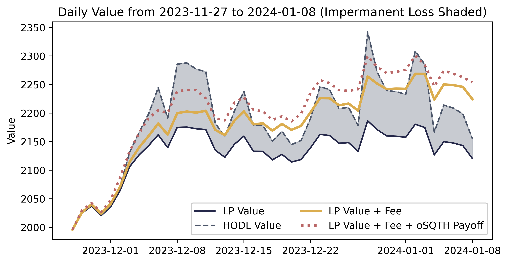
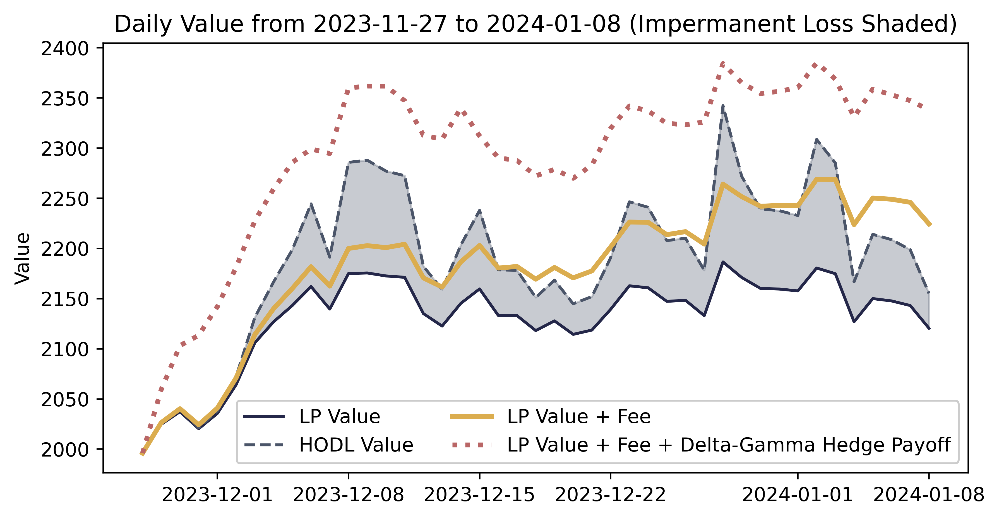
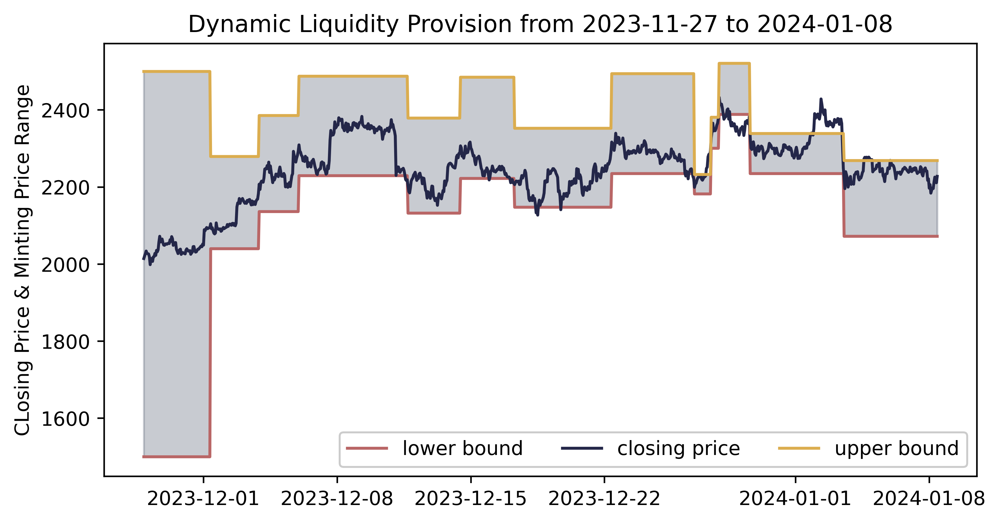
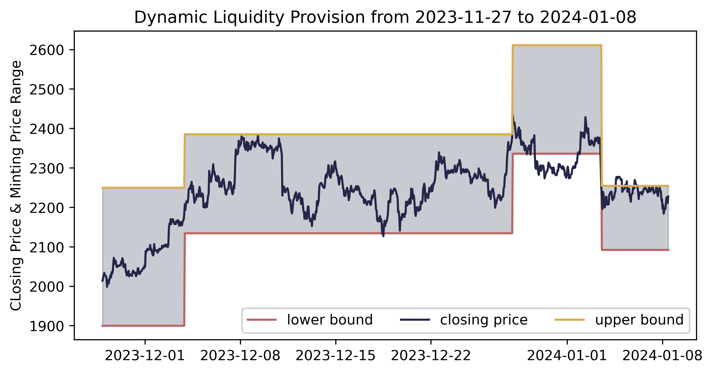
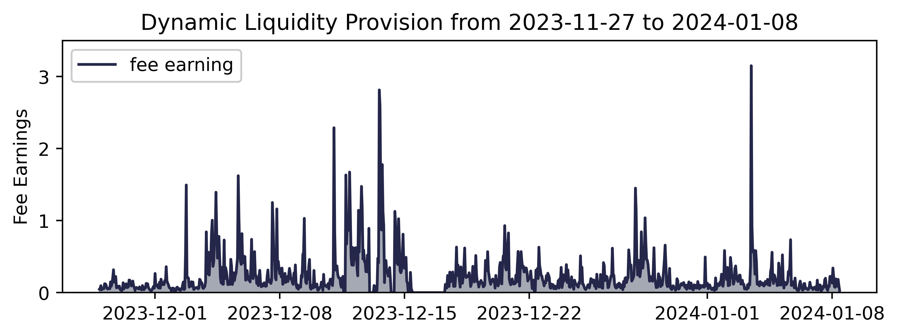
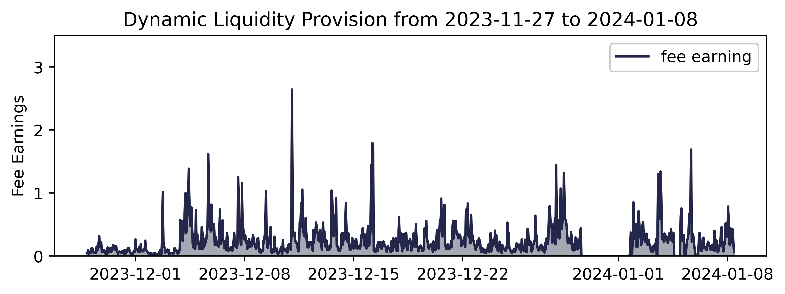

# DeFiNER
**Decentralized Finance Navigates Every Route**

*A Solution Framework for Modeling and Hedging Impermanent Loss and
Dynamic Liquidity Provision Using Deep Reinforcement Learning
in Uniswap V3 with Concentrated Liquidity*.      
Fintech-as-a-Service (FaaS): Hackathon of NUS Fintech Summit 2024.     
Authors: 
[Jiaxiang Cheng](https://www.linkedin.com/in/jiaxiang-cheng/),
[Xuejing Lyu](https://www.linkedin.com/in/xuejing-lyu-752297178/)

 

## Overview

This project provides a solution framework for hedging impermanent loss of liquidity
providers in Uniswap V3 with concentrated liquidity provision, which is realized
with a delta-gamma hedging strategy. The bact-testing showcase is presented below:

[//]: # (![showcase]&#40;img/back-testing_delta-gamma_rounded.png&#41;)

|         Gamma Hedging Strategy          |             Delta-Gamma Hedging Strategy              |
|:---------------------------------------:|:-----------------------------------------------------:|
|  |  |

[//]: # (![showcase]&#40;img/back-testing_delta-gamma.png&#41;)

Based on the back-testing results, 
of which the process is documented in 
[3.3 Back-testing Delta-Gamma Hedge.ipynb](https://github.com/jiaxiang-cheng/definer/blob/34541a261b500138453757c3da131004d91a774a/notebooks/3.3%20Back-testing%20Delta-Gamma%20Hedge.ipynb) 
in detail,
the proposed hedging strategy is potential for
fully hedging the impermanent loss raised from the liquidity position in Uniswap V3.

We also proposed a dynamic minting strategy based on deep deterministic policy
gradient (DDPG), which is a kind of deep reinforcement learning model, together with
the tau-reset strategy. The bact-testing showcase is presented below:

[//]: # (![showcase]&#40;img/dynamic_minting_tau100.png&#41;)

[//]: # (![showcase]&#40;img/dynamic_minting_fee_tau100.png&#41;)

|                    tau = 100                    |                    tau = 200                    |
|:-----------------------------------------------:|:-----------------------------------------------:|
|      |      |
|  |  |


## Notebooks

The current project is initially oriented with Jupyter Notebooks, 
including results from static modelling to dynamic back-testing, for both
hedging strategy and minting strategy:

| DeFiNER Notebooks  `./notebooks/`                                                                                                                                                                                                  | 
|------------------------------------------------------------------------------------------------------------------------------------------------------------------------------------------------------------------------------------|
| **Chapter 1**                                                                                                                                                                                                                      | 
| [1.1 Impermanent Loss.ipynb](https://github.com/jiaxiang-cheng/definer/blob/45f8c8d35d231ff8551f2524bb1b65db00dd3106/notebooks/1.1%20Impermanent%20Loss.ipynb)                                                                     | 
| Static impermanent loss (IL) modelling of liquidity provider with both uniform and concentrated liquidity                                                                                                                          | 
| [1.2 Profit & Loss.ipynb](https://github.com/jiaxiang-cheng/definer/blob/45f8c8d35d231ff8551f2524bb1b65db00dd3106/notebooks/1.2%20Profit%20%26%20Loss.ipynb)                                                                       | 
| Static profit and loss (PNL) modelling with uniform liquidity (**TO DO**: with concentrated liquidity)                                                                                                                             | 
|                                                                                                                                                                                                                                    | 
| **Chapter 2**                                                                                                                                                                                                                      | 
| [2.1 Delta Hedging.ipynb](https://github.com/jiaxiang-cheng/definer/blob/45f8c8d35d231ff8551f2524bb1b65db00dd3106/notebooks/2.1%20Delta%20Hedging.ipynb)                                                                           | 
| Static demonstration of delta hedging strategy powered by Deribit options and accelerated SGD algorithm                                                                                                                            | 
| [2.2 Delta-Gamma Hedging.ipynb](https://github.com/jiaxiang-cheng/definer/blob/45f8c8d35d231ff8551f2524bb1b65db00dd3106/notebooks/2.2%20Delta-Gamma%20Hedging.ipynb)                                                               | 
| Static demonstration of delta-gamma hedging strategy power by Squeeth and Deribit options                                                                                                                                          | 
|                                                                                                                                                                                                                                    | 
| **Chapter 3**                                                                                                                                                                                                                      | 
| [3.1 Back-testing No Hedge.ipynb](https://github.com/jiaxiang-cheng/definer/blob/45f8c8d35d231ff8551f2524bb1b65db00dd3106/notebooks/3.1%20Back-testing%20No%20Hedge.ipynb)                                                         | 
| Back-testing with no hedging strategy while fee and impermanent loss calculated                                                                                                                                                    | 
| [3.2 Back-testing Delta Hedge.ipynb](https://github.com/jiaxiang-cheng/definer/blob/45f8c8d35d231ff8551f2524bb1b65db00dd3106/notebooks/3.2%20Back-testing%20Delta%20Hedge.ipynb)                                                   | 
| Back-testing with delta hedging strategy applied with compared performance to no hedging strategy applied. The results show that delta hedging strategy together with fee earned can partially hedge the impermanent loss.         | 
| [3.3 Back-testing Delta-Gamma Hedge.ipynb](https://github.com/jiaxiang-cheng/definer/blob/41c71bfdfbbd5987fc360935072ff82574e231b1/notebooks/3.3%20Back-testing%20Delta-Gamma%20Hedge.ipynb)                                       | 
| Back-testing with delta-gamma hedging strategy applied with compared performance. The results whos that delta-gamma hedging strategy can potentially fully hedge the impermanent loss, thus achieved the optimal performance.      | 
|                                                                                                                                                                                                                                    | 
| **Chapter 4**                                                                                                                                                                                                                      | 
| [4.1 Deep Deterministic Policy Gradient.ipynb](https://github.com/jiaxiang-cheng/definer/blob/45f8c8d35d231ff8551f2524bb1b65db00dd3106/notebooks/4.1%20Deep%20Deterministic%20Policy%20Gradient%20Development.ipynb)               | 
| Development of DDPG algorithm using PyTorch                                                                                                                                                                                        | 
| [4.3.3 Back-testing Dynamic Minting (Tau-Reset = 200)](https://github.com/jiaxiang-cheng/definer/blob/41c71bfdfbbd5987fc360935072ff82574e231b1/notebooks/4.3.3%20Back-testing%20Dynamic%20Minting%20(Tau-Reset%20%3D%20200).ipynb) | 
| Back-testing with dynamic minting strategy based on DDPG algorithm and tau-reset strategy.                                                                                                                                         |

## Credits

Awesome reference for core calculation in Uniswap V3 during back-testing:    
[DefiLab-xyz/uniswap-v3-backtest-python](https://github.com/DefiLab-xyz/uniswap-v3-backtest-python), integrated in `./api/definer/core.py`

Hedging solutions partially inspired by:    
[adamkhakhar/lp-delta-hedge](https://github.com/adamkhakhar/lp-delta-hedge)

## References

Schaller, A. J. (2022). Hedging the Risks of Liquidity Providers [Bachelor’s Thesis]. ETH Zürich.

Khakhar, A., & Chen, X. (2022). Delta Hedging Liquidity Positions on Automated Market Makers (arXiv:2208.03318). arXiv. https://doi.org/10.48550/arXiv.2208.03318

Fan, Z., Marmolejo-Cossío, F., Moroz, D. J., Neuder, M., Rao, R., & Parkes, D. C. (2023). Strategic Liquidity Provision in Uniswap v3 (arXiv:2106.12033). arXiv. http://arxiv.org/abs/2106.12033

Silver, D., Lever, G., Heess, N., Degris, T., Wierstra, D., & Riedmiller, M. (2014). Deterministic Policy Gradient Algorithms. Proceedings of the 31st International Conference on Machine Learning, 387–395. https://proceedings.mlr.press/v32/silver14.html

Cao, J., Chen, J., Hull, J., & Poulos, Z. (2021). Deep Hedging of Derivatives Using Reinforcement Learning. The Journal of Financial Data Science, 3(1), 10–27. https://doi.org/10.3905/jfds.2020.1.052

Prospere, W. (2022, May 19). Squeeth Primer: A guide to understanding Opyn’s implementation of Squeeth. Opyn. https://medium.com/opyn/squeeth-primer-a-guide-to-understanding-opyns-implementation-of-squeeth-a0f5e8b95684

Elsts, A. (2023). Liquidity Math in Uniswap v3. SSRN Electronic Journal. https://doi.org/10.2139/ssrn.4575232

Clark, J. (2022, November 16). Hedging Uniswap v3 with SQUEETH. Opyn. https://medium.com/opyn/hedging-uniswap-v3-with-squeeth-bcaf1750ea11

Hedging Impermanent Loss with Power Perpetuals (2). (n.d.). Retrieved January 6, 2024, from https://docs.deri.io/library/academy/power-perpetuals/hedging-impermanent-loss-with-power-perpetuals-2

-----

For more information, please check out our video pitch and documented report.

[//]: # (```)

[//]: # (pip install "fastapi[all]")

[//]: # (```)

[//]: # (```)

[//]: # (uvicorn main:app --reload)

[//]: # (```)
[//]: # (http://127.0.0.1:8000    )
[//]: # (http://127.0.0.1:8000/docs)