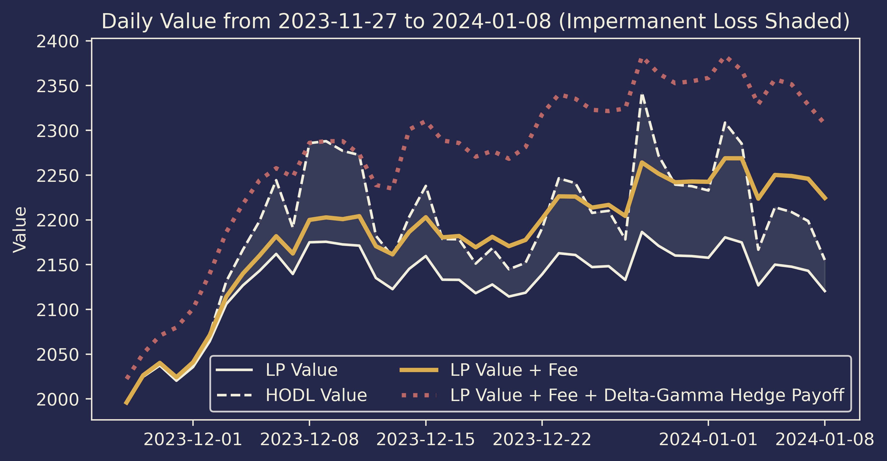

# DeFiNER
**Decentralized Finance Navigates Every Route**    
*A Solution Framework for Modeling and Hedging Impermanent Loss and
Dynamic Liquidity Provision Using Deep Reinforcement Learning
in Uniswap V3 with Concentrated Liquidity*. Fintech as a Service (FaaS): Hackathon of NUS Fintech Summit 2024.     
Authors: 
[Jiaxiang Cheng](https://www.linkedin.com/in/jiaxiang-cheng/),
[Xuejing Lyu](https://www.linkedin.com/in/xuejing-lyu-752297178/)

 

-----

This project provides a solution framework for hedging impermanent loss of liquidity
providers in Uniswap V3 with concentrated liquidity provision, which is realized
with a delta-gamma hedging strategy. The bact-testing showcase is presented below:



[//]: # (![showcase]&#40;img/back-testing_delta-gamma.png&#41;)

Based on the back-testing results, 
of which the process is documented in 
[3.3 Back-testing Delta-Gamma Hedge.ipynb](https://github.com/jiaxiang-cheng/definer/blob/main/3.3%20Back-testing%20Delta-Gamma%20Hedge.ipynb) 
in detail,
the proposed hedging strategy is potential for
fully hedging the impermanent loss raised from the liquidity position in Uniswap V3.

## Overview

As required by the submission criterion of the hackathon, the project is initially
oriented with Jupyter Notebooks, including results from static modelling to dynamic back-testing:

| DeFiNER Notebooks                                                                                                                                                                                                             | 
|-------------------------------------------------------------------------------------------------------------------------------------------------------------------------------------------------------------------------------|
| **Chapter 1**                                                                                                                                                                                                                 | 
| [1.1 Impermanent Loss.ipynb](https://github.com/jiaxiang-cheng/definer/blob/main/1.1%20Impermanent%20Loss.ipynb)                                                                                                              | 
| Static impermanent loss (IL) modelling of liquidity provider with both uniform and concentrated liquidity                                                                                                                     | 
| [1.2 Profit & Loss.ipynb](https://github.com/jiaxiang-cheng/definer/blob/main/1.2%20Profit%20%26%20Loss.ipynb)                                                                                                                | 
| Static profit and loss (PNL) modelling with uniform liquidity (**TO DO**: with concentrated liquidity)                                                                                                                        | 
|                                                                                                                                                                                                                               | 
| **Chapter 2**                                                                                                                                                                                                                 | 
| [2.1 Delta Hedging.ipynb](https://github.com/jiaxiang-cheng/definer/blob/main/2.1%20Delta%20Hedging.ipynb)                                                                                                                    | 
| Static demonstration of delta hedging strategy powered by Deribit options and accelerated SGD algorithm                                                                                                                       | 
| [2.2 Delta-Gamma Hedging.ipynb](https://github.com/jiaxiang-cheng/definer/blob/main/2.2%20Delta-Gamma%20Hedging.ipynb)                                                                                                        | 
| Static demonstration of delta-gamma hedging strategy power by Squeeth and Deribit options                                                                                                                                     | 
|                                                                                                                                                                                                                               | 
| **Chapter 3**                                                                                                                                                                                                                 | 
| [3.1 Back-testing No Hedge.ipynb](https://github.com/jiaxiang-cheng/definer/blob/main/3.1%20Back-testing%20No%20Hedge.ipynb)                                                                                                  | 
| Back-testing with no hedging strategy while fee and impermanent loss calculated                                                                                                                                               | 
| [3.2 Back-testing Delta Hedge.ipynb](https://github.com/jiaxiang-cheng/definer/blob/main/3.2%20Back-testing%20Delta%20Hedge.ipynb)                                                                                            | 
| Back-testing with delta hedging strategy applied with compared performance to no hedging strategy applied. The results show that delta hedging strategy together with fee earned can partially hedge the impermanent loss.    | 
| [3.3 Back-testing Delta-Gamma Hedge.ipynb](https://github.com/jiaxiang-cheng/definer/blob/main/3.3%20Back-testing%20Delta-Gamma%20Hedge.ipynb)                                                                                | 
| Back-testing with delta-gamma hedging strategy applied with compared performance. The results whos that delta-gamma hedging strategy can potentially fully hedge the impermanent loss, thus achieved the optimal performance. | 
|                                                                                                                                                                                                                               | 
| **Chapter 4**                                                                                                                                                                                                                 | 
| [4.1 Deep Deterministic Policy Gradient.ipynb](https://github.com/jiaxiang-cheng/definer/blob/main/4.1%20Deep%20Deterministic%20Policy%20Gradient.ipynb)                                                                      | 
| Initial implementation of DDPG algorithm using PyTorch                                                                                                                                                                        | 
| *coming soon ...*                                                                                                                                                                                                             | 
| Dynamic minting strategy with DDPG algorithm                                                                                                                                                                                  |

For more information, please check out our video pitch and documented report.

[//]: # (```)

[//]: # (pip install "fastapi[all]")

[//]: # (```)

[//]: # (```)

[//]: # (uvicorn main:app --reload)

[//]: # (```)
[//]: # (http://127.0.0.1:8000    )
[//]: # (http://127.0.0.1:8000/docs)